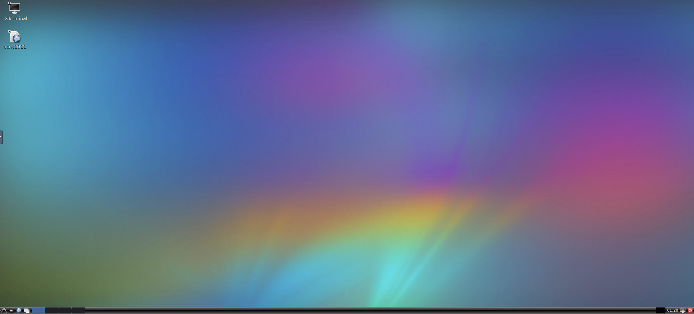

# Software repository for OIST Computational Neuroscience Course (OCNC)

This repository provides Docker image with pre-compiled computational neuroscience software and usage instructions for the OIST Computational Neuroscience Course (OCNC). For more information of the course, please visit [https://groups.oist.jp/ocnc](https://groups.oist.jp/ocnc).

## Prerequisites
Download and install Docker Desktop [https://www.docker.com/products/docker-desktop/](https://www.docker.com/products/docker-desktop/). For Mac users, please note that Docker provides different installers for Intel and Apple silicon cpu.

## Fetch and use the OCNC docker image
1. start the Docker Desktop application.
2. Open a Terminal/Command prompt/PowerShell.
3. In the Terminal, prepare a directory for storing your exercise files, and `cd` to this directory. e.g.:
    ```
    mkdir ocnc_tutorial
    cd ocnc_tutorial
    ```
4. In the Terminal, execute the following command to fetch and start the OCNC docker container, note that ``-v `pwd`/:/work`` mount your current directory (in the above case, `ocnc_tutorial`) as `/work` in your Docker container system, and `--rm` set the container to be destroyed automatically after use (i.e. any change to the docker system will not be saved except the files stored in `/work`). For more information about the Docker commands, please visit [https://docs.docker.com/engine/reference/commandline/run/](https://docs.docker.com/engine/reference/commandline/run/).

    ```
    docker pull cnsoist/ocnc:2023
    docker run -p 6080:80 --rm -v `pwd`:/work cnsoist/ocnc:2023
    ```
    
    for Windows, you may need to specify the path of your directory, e.g.
    ```
    docker run -p 6080:80 --rm -v C:\Users\ocnc2023\ocnc_tutorial:/work cnsoist/ocnc:2023
    ```
    
    You should see similar information as below from the Terminal.

    

5. Open a web browser and enter: [http://127.0.0.1:6080/](http://127.0.0.1:6080/). The following interface should be shown in the browser.

    

6. Double click the `LXTerminal` icon to open a terminal in the docker system. You can also double click the `ocnc` icon to access this repository page for future references.

    

7. In the `LXTerminal`, `cd` to `\work`.
    ```
    cd /work
    ```
    You can store and exchange files between your host system and the docker system here.
    
    Then clone the ocnc github repository.
    ```
    git clone https://github.com/CNS-OIST/ocnc.git
    ```
    go into the directory, and start Jupyter notebook
    ```
    cd ocnc
    jupyter notebook --ip=0.0.0.0 --allow-root
    ```
    A Jupyter notebook interface should pop up, within it, open the `simulator_tests.ipynb`, and from the top menu select `Cell`->`Run All`.
    Please check the default behaviors of this test from the video below, if yours behave differently, please contact <w.chen@oist.jp>.

    | [](https://www.youtube.com/watch?v=vG2obB0_lDk) |
    |:--:|
    | <b>OCNC Docker image test demostration (Youtube)</b>|

8. At the tutorial sessions, start the computational neuroscience software according to your tutorial instructions from the `LXTerminal`. Here are some general commands for different software.
    * update the ocnc github repository.
        ```
        cd /work/ocnc
        git pull
        ```
    * Copying and Pasting
        * General e.g. in `Firefox`: `ctrl` + `c`, `ctrl` + `v` 
        * In `LXTerminal`: `ctrl` + `shift` + `c`, `ctrl` + `shift` + `v`
        * Between the host system and the docker system: Click the clipboard button in the left `novnc` sidebar, it contains the clipboard content of the docker system.
            
    * Jupyter notebook
        ```
        jupyter notebook --ip=0.0.0.0 --allow-root
        ```
    * Jupyterlab
        ```
        jupyter lab --ip=0.0.0.0 --allow-root
        ```
    * Python3
        ```
        python
        ```
        and with in Python
        * NEURON [https://neuron.yale.edu/neuron/](https://neuron.yale.edu/neuron/)
            ```
            import neuron
            ```
        * NEST [https://nest-simulator.readthedocs.io/en/v3.3/](https://nest-simulator.readthedocs.io/en/v3.3/)
            ```
            import nest
            ```
        * STEPS[http://steps.sourceforge.net/](http://steps.sourceforge.net/)
            ```
            import steps
            ```
        * Brian2[https://brian2.readthedocs.io/en/stable/](https://brian2.readthedocs.io/en/stable/)
            ```
            import brian2
            ```
        * Pystan [https://pystan.readthedocs.io/en/latest/](https://pystan.readthedocs.io/en/latest/)
            ```
            import pystan
            ```
    * NEURON with GUI and hoc interpreter
        ```
        nrngui
        ```
9. Once you finish your work, make sure your files have been saved to `/work` (aka `ocnc_tutorial` in your host system), then go back to the Terminal/Command prompt/PowerShell of your host system, and press `ctrl + c` to stop the docker container.

## Connect to the docker system using vnc viewer

If you want to connect to the docker system using a vnc viewer such as [https://www.realvnc.com/en/connect/download/viewer/](https://www.realvnc.com/en/connect/download/viewer/) instead of the browser, start the docker with
```
docker run -p 6080:80 -p 5900:5900 --rm -v `pwd`:/work cnsoist/ocnc:2022
```
Open your vnc viewer and enter `127.0.0.1:5900` as the address


a vnc connection to the docker system should then be displayed.

