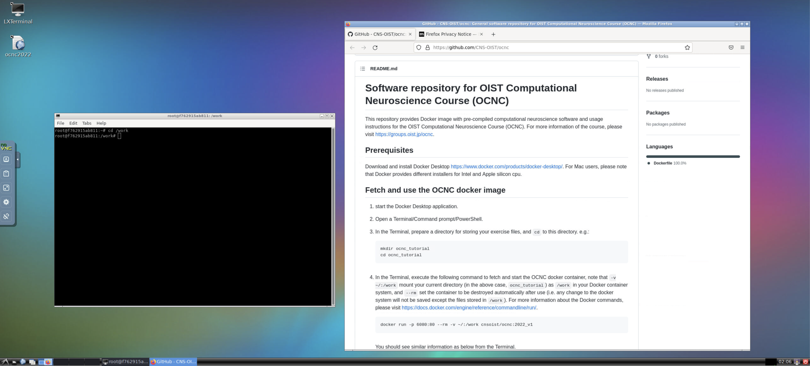

# Software repository for OIST Computational Neuroscience Course (OCNC)
This repository provides Docker image with pre-compiled computational neuroscience software and usage instructions for the OIST Computational Neuroscience Course (OCNC). For more information of the course, please visit [https://groups.oist.jp/ocnc](https://groups.oist.jp/ocnc).

## Prerequisites
Download and install Docker Desktop [https://www.docker.com/products/docker-desktop/](https://www.docker.com/products/docker-desktop/). For Mac users, please note that Docker provides different installers for Intel and Apple silicon cpu.

## Fetch and use the OCNC docker image
1. start the Docker Desktop application.
2. Open a Terminal/Command prompt/PowerShell.
3. In the Terminal, prepare a directory for storing your exercise files, and `cd` to this directory. e.g.:
    ```
    mkdir ocnc_tutorial
    cd ocnc_tutorial
    ```
4. In the Terminal, execute the following command to fetch and start the OCNC docker container, note that `-v ~/:/work` mount your current directory (in the above case, `ocnc_tutorial`) as `/work` in your Docker container system, and `--rm` set the container to be destroyed automatically after use (i.e. any change to the docker system will not be saved except the files stored in `/work`). For more information about the Docker commands, please visit [https://docs.docker.com/engine/reference/commandline/run/](https://docs.docker.com/engine/reference/commandline/run/).

    ```
    docker run -p 6080:80 --rm -v ~/:/work cnsoist/ocnc:2022_v1
    ```
    You should see similar information as below from the Terminal.

    

5. Open a web browser and enter: [http://127.0.0.1:6080/](http://127.0.0.1:6080/). The following interface should be shown in the browser.

    

6. Double click the `LXTerminal` icon to open a terminal in the docker system. You can also double click the `ocnc2022` icon to access this repository page for future references.

    

7. In the `LXTerminal`, `cd` to `\work`.
    ```
    cd /work
    ```
    You can store and exchange files between your host system and the docker system here.

8. Start the computational neuroscience software according to your tutorial instructions from the `LXTerminal`. Here are some general commands for different software.
    * Python3
        ```
        python
        ```
        and with in Python
        * NEURON [https://neuron.yale.edu/neuron/](https://neuron.yale.edu/neuron/)
            ```
            import neuron
            ```
        * NEST [https://nest-simulator.readthedocs.io/en/v3.3/](https://nest-simulator.readthedocs.io/en/v3.3/)
            ```
            import nest
            ```
        * STEPS[http://steps.sourceforge.net/](http://steps.sourceforge.net/)
            ```
            import steps
            ```
        * Brian2[https://brian2.readthedocs.io/en/stable/](https://brian2.readthedocs.io/en/stable/)
            ```
            import brian2
            ```
        * Pystan [https://pystan.readthedocs.io/en/latest/](https://pystan.readthedocs.io/en/latest/)
            ```
            import stan
            ```
    * Jupyter notebook
        ```
        jupyter notebook --ip=0.0.0.0 --allow-root
        ```
    * Jupyterlab
        ```
        jupyter lab --ip=0.0.0.0 --allow-root
        ```
    * NEURON with GUI and hoc interpreter
        ```
        nrngui
        ```
9. Once you finish your work, make sure your files have been saved to `/work` (aka `ocnc_tutorial` in your host system), then go back to the Terminal/Command prompt/PowerShell of your host system, and press `ctrl + c` to stop the docker container.